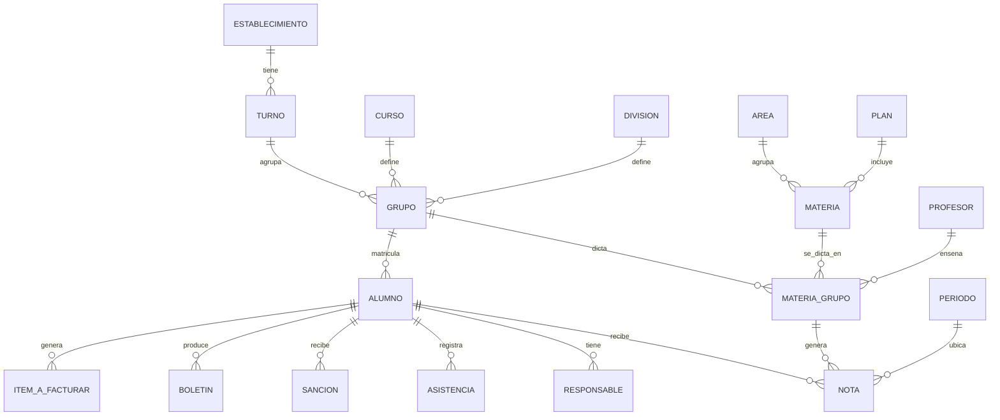

# Dominio académico — mapa de entidades y preguntas para Mariela (borrador)

> **Encuadre.** Este es un **borrador de trabajo** para alinear el dominio académico con **Mariela** (referente). **No es fuente de verdad ni un esquema de datos.** El modelo real vivirá en el **código + las migraciones**; cuando eso exista, este doc se archiva. Todo lo de acá está **inferido del legacy** (`Legacy/EducatioSecVB/SecundarioV4`, minando el SQL de los formularios VB6) y hay que **confirmarlo**. Los nombres entre paréntesis son las **tablas del legacy** que respaldan cada entidad, para trazabilidad.

## Cómo se leyó

El legacy no tiene un modelo de datos formal (el `.PDM` resultó ser el paquete de instalación VB6, no un esquema). Las entidades salen de las tablas referenciadas en el SQL de los formularios. Una **DB real de Educatio** (Access `.mdb` o dump) permitiría confirmar tablas, columnas y cardinalidades exactas — queda pendiente.

---

## 1. Mapa de entidades núcleo (MVP académico)

### Estructura académica (la "grilla" de la escuela)

- **Establecimiento** (`establecimiento`, `parametros`) — la institución y su configuración. Una sola (no multitenant).
- **Ciclo/Año lectivo** — el año escolar. Casi todo se filtra por año lectivo y se "pasa de año" al cerrar.
- **Turno** (`turno`) — mañana / tarde / etc.
- **Curso** (`curso`) — el año de estudio (1º, 2º, 3º…).
- **División** (`division`) — A, B, C…
- **Grupo** (`grupo`) — **la clase concreta**: cruce de curso + división (+ turno) para un ciclo lectivo (ej. "2º B mañana"). Es la unidad operativa: los alumnos se matriculan en un grupo, y las materias/notas/asistencia cuelgan del grupo.
  - Relaciones vistas en el legacy: `grupo.curso → curso`, `grupo.division → division`.
- **Área** (`area`) — agrupa materias (ej. Ciencias, Lengua).
- **Materia** (`materias`) — asignatura; pertenece a un área (`materias.cod_area → area`).
- **Plan de estudios** (`plan`, `materiascargadasdeunplan`) — qué materias corresponden a un curso/nivel.
- **Materias por grupo** (`materiasporgrupo`) — qué materias se dictan en cada grupo y con qué docente.
- **Grupos especiales** (`gruposesp`, `gruposesp_tipo`, `gruposesp_modulo`, `gruposesp_alumnos`, `gruposesp_materias`) — agrupaciones no estándar (talleres/optativas) con sus alumnos y materias.

### Personas

- **Alumno** (`alumnos`, `alumnos_albumfoto`) — identificado por **legajo**. Matriculado en un grupo por ciclo lectivo.
- **Matriculación / Rematriculación** (`alumnosrematriculacion`, `alumnosreincriptos`, `v_rematriculacionalumnos`, `consultamatriculainscripcion`) — alta en el año y reinscripción del año anterior.
- **Responsable** — adulto a cargo. En el legacy aparece **por rol**:
  - `responsablescobros` — el responsable de pago/facturación.
  - `resppedagogico` — responsable pedagógico.
  - `responsablesinformado` / `responsablescbu` — informado / datos bancarios.
  - → sugiere **un alumno con varios responsables, cada uno con un rol**. A confirmar.
- **Docente / Profesor** (`profesor`, `planillahistoricodocentes`, `v_planilladocente`, `documentacionprofe`, `evaluaciondocentes`) — dicta materias en grupos; se registran faltas y evaluaciones.

### Cursada: calificaciones y asistencia

- **Calificación / Nota** (`notas`, `calificacion`) — nota de un alumno en una materia, por **período**.
- **Períodos** (`periodos`, `meses`) — trimestres/cuatrimestres/etapas del ciclo.
- **Nota actitudinal / conceptual** (`notasactitudinal`, `notasactitudinaldetalle`, `conceptosaevaluar`) — valoración cualitativa.
- **Concepto** (`concepto`, `conceptointerno`, `c_concepto`) — concepto del alumno (interno y para boletín).
- **Asistencia** (`tomarasistencia`, `ausentismo`, `asistenciamensual`, `totalfaltas`) — presencia diaria, consolidado mensual y total de faltas.
- **Días hábiles** (`boletinesdiashabiles`) — base para el cómputo de asistencia del boletín.

### Documentos y salidas

- **Boletín** (`boletines`, `informados`, `cursosinformados`, `accionesinformado`) — reporte de notas + asistencia + conceptos por período.
- **Documentación del legajo** (`documentacion`, `gestiondocumentacion`, `documentacioninformado`) — qué papeles presentó/faltan.
- **Certificados** — constancias (alumno regular, analítico). (Pantallas de certificados en el legacy.)

### Convivencia y comunicación

- **Sanciones** (`totalsanciones`, `consultasanciones`) y **acciones** disciplinarias.
- **Cuaderno de comunicaciones** (`cc_categorias`, `cc_tags`, `cc_comunicaciontags`, `cc_destinatarioscomunicacion`) — mensajes escuela ↔ familia, categorizados/etiquetados.

### Puente al administrativo

- **Ítems a facturar** (`itemsafacturar`) — lo académico que se factura al responsable (cuotas/conceptos). Es el nexo con el módulo administrativo; define hasta dónde llega el MVP académico.

### Catálogos

- **Geográficos** (`ciudad`, `provincia`, `nacionalidad`), **comedor** (`cuponescomedor`), **usuarios** (`usuarios`).

---

## 2. Diagrama (relaciones núcleo)

> Cardinalidades y campos son **tentativos** — a confirmar con Mariela y/o con la DB del legacy.

---

## 3. Preguntas para Mariela

Ordenadas: primero las que **condicionan el modelo de datos** (hay que resolverlas antes de estampar el primer CRUD), después las de **alcance del MVP**.

### A. Estructura y niveles (condicionan el modelo)

1. **Primaria vs Secundaria: ¿mismo modelo o distinto?** En primaria suele haber **un docente por grado** y calificación conceptual; en secundaria, **materias con un profesor cada una** y nota numérica. ¿Los modelamos como un solo esquema parametrizado o como dos realidades distintas?
2. **¿Qué es exactamente un "grupo"?** ¿El cruce curso + división + turno para un ciclo lectivo (ej. "2ºB TM")? ¿El alumno se matricula en el grupo, o en curso/división por separado?
3. **¿Un alumno tiene un legajo único que lo acompaña de primaria a secundaria, o son legajos/inscripciones distintas por nivel?**

### B. Calificaciones (condicionan el modelo)

4. **Escala de notas por nivel:** ¿numérica (1–10), conceptual (ej. "Muy Bueno"), o ambas según nivel/materia? ¿Quién define la escala válida?
5. **Períodos del ciclo:** ¿trimestres, cuatrimestres, bimestres? ¿Iguales para primaria y secundaria?
6. **Nota definitiva:** ¿cómo se calcula (promedio, criterio del docente, con recuperatorios)? ¿Automática o la carga el docente?
7. **Notas actitudinales/conceptos:** ¿van en el boletín oficial o son internos? ¿Escala propia?

### C. Asistencia (condiciona el modelo)

8. **¿La asistencia es por jornada/día o por materia/hora?** ¿Existen media falta, tardanza, faltas justificadas/injustificadas?
9. **¿Cómo impacta la asistencia** en el boletín y en la condición del alumno (regular/libre)?

### D. Personas

10. **Responsables:** ¿un alumno puede tener varios (cobro, pedagógico, informado)? ¿Un mismo responsable cubre a varios hermanos? ¿Qué datos son obligatorios?
11. **Docentes:** ¿un profesor dicta varias materias en varios grupos? ¿Se necesita su carga horaria/asignación formal en el MVP?

### E. Matriculación

12. **Flujo de matriculación y pase de año:** ¿cómo se promueve un grupo al ciclo siguiente? ¿Cómo se maneja **repitencia**, **pase de división**, **baja** y **reinscripción**?

### F. Alcance del MVP (qué entra ahora y qué es fase 2)

13. De estos, **¿qué es MVP y qué queda para después?**: boletín oficial, certificados, **cuaderno de comunicaciones**, **sanciones/convivencia**, **grupos especiales** (talleres/optativas), **documentación del legajo**, **comedor**, **álbum de fotos**, evaluaciones docentes.
14. **Boletín:** ¿hay un formato oficial obligatorio (jurisdicción)? ¿Se imprime, se manda por mail, ambos?
15. **Puente con administrativo:** ¿el MVP académico **genera algo a facturar** (`itemsafacturar`), o el administrativo queda 100% separado en esta etapa?
16. **¿Cuál es la pantalla/flujo que más duele hoy en el legacy** y daría más valor migrar primero? (Sirve para elegir el primer CRUD de referencia.)

---

## 4. Sugerencia de primer CRUD de referencia

Para fijar el patrón sin depender de decisiones abiertas, conviene una entidad **real pero poco entrelazada**. Candidatas: **Materias** (código + descripción + área, con `activo`) o la **estructura** (curso/división/turno). Se decide con la respuesta a la pregunta 16.
